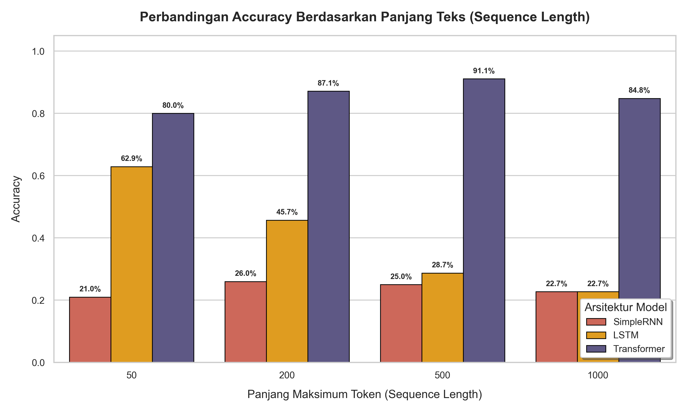
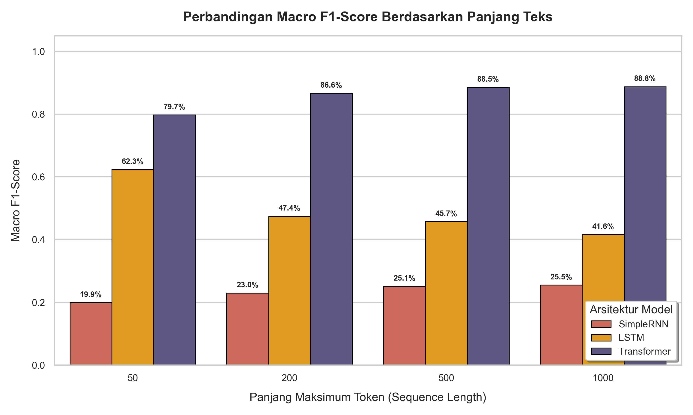
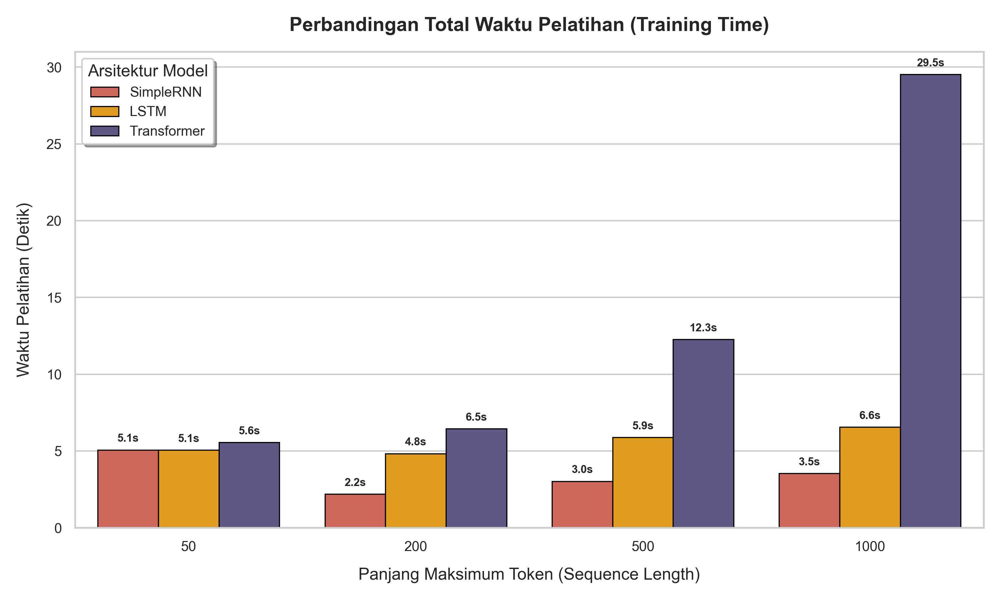
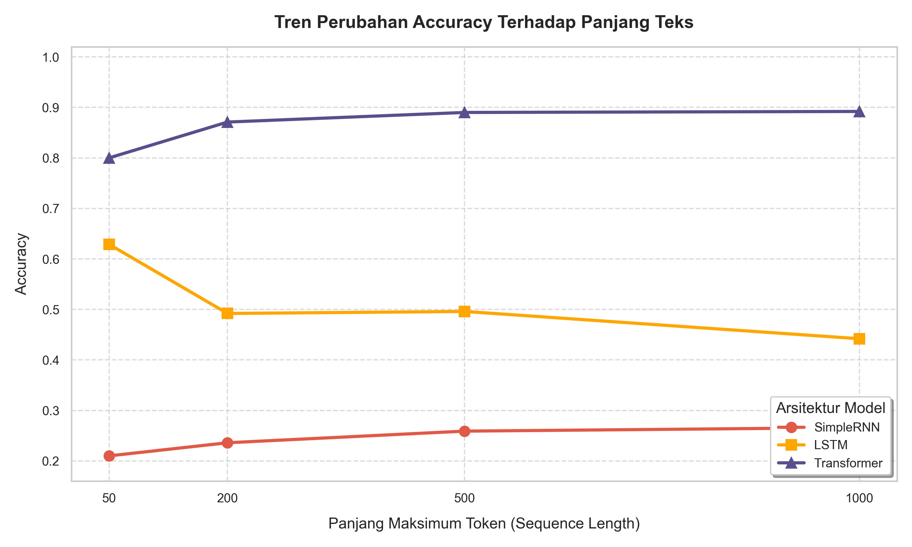
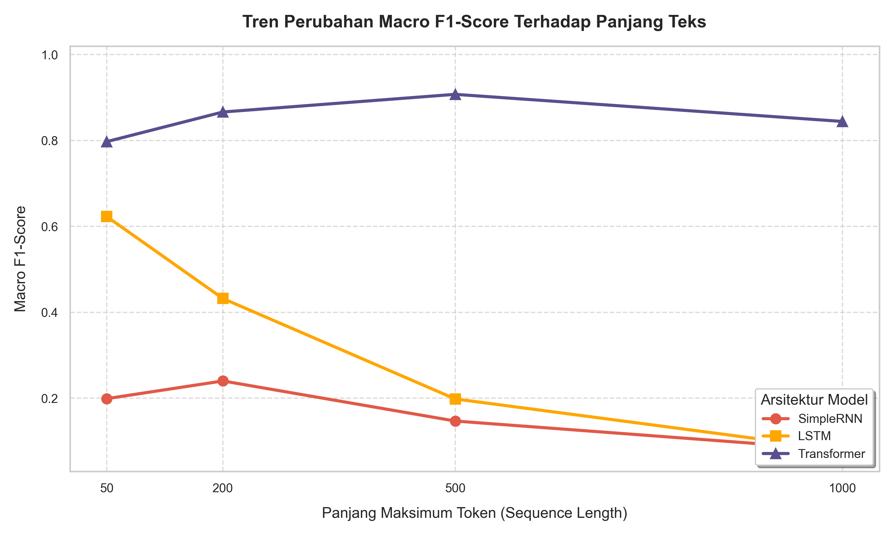

# Laporan Evaluasi Arsitektur NLP: Simple RNN vs LSTM vs Transformer (From Scratch)
### Studi Kasus: Klasifikasi Berita BBC News berdasarkan Variasi Panjang Teks (Sequence Length)

Laporan ini menyajikan rangkuman kode, output eksekusi, grafik perbandingan performa, serta analisis akademis mendalam atas evaluasi tiga arsitektur Deep Learning utama untuk NLP (Simple RNN, LSTM, dan Transformer) yang dibangun dari awal (*from scratch*) menggunakan PyTorch.

---

## 1. Pustaka & Konfigurasi Perangkat Keras
Kode untuk memverifikasi kesiapan perangkat keras (GPU CUDA) dan mengimpor pustaka utama.

### Sel Kode:
```python
import os
import math
import time
import json
import random
import copy
import numpy as np
import pandas as pd
import torch
import torch.nn as nn
from torch.utils.data import Dataset, DataLoader
from datasets import load_dataset
from sklearn.model_selection import train_test_split
from sklearn.metrics import accuracy_score, precision_score, recall_score, f1_score
import matplotlib.pyplot as plt
import seaborn as sns
from tqdm.notebook import tqdm

# Setup Device Komputasi
DEVICE = torch.device("cuda" if torch.cuda.is_available() else "cpu")
print("=" * 50)
print(f"DEVICE YANG DIGUNAKAN: {DEVICE}")
if DEVICE.type == "cuda":
    print(f"GPU Model: {torch.cuda.get_device_name(0)}")
print("=" * 50)
```

### Output Eksekusi:
```text
==================================================
DEVICE YANG DIGUNAKAN: CUDA
GPU Model: NVIDIA GeForce RTX 3060 Laptop GPU
==================================================
```

---

## 2. Konfigurasi Eksperimen
Mendefinisikan parameter konfigurasi pusat untuk dataset, hyperparameter model, skenario sequence length, dan reproduksibilitas.

### Sel Kode:
```python
RANDOM_SEED = 42

# Konfigurasi Dataset
DATASET_NAME = "SetFit/bbc-news"
NUM_CLASSES = 5
LABEL_MAP = {
    0: "business",
    1: "entertainment",
    2: "politics",
    3: "sport",
    4: "tech"
}

# Parameter Vocabulary & Preprocessing
VOCAB_SIZE = 20000
PAD_TOKEN = "<pad>"
UNK_TOKEN = "<unk>"

# Hyperparameter Arsitektur Model
EMBEDDING_DIM = 128
HIDDEN_DIM = 128

# Parameter Khusus Transformer
TRANSFORMER_HEADS = 4
TRANSFORMER_LAYERS = 2
TRANSFORMER_FF_DIM = 256
TRANSFORMER_DROPOUT = 0.1

# Hyperparameter Training
BATCH_SIZE = 64
NUM_EPOCHS = 8
LEARNING_RATE = 1e-3
PATIENCE = 2

# Skenario Panjang Sequence yang Diuji
SEQ_LENGTHS = [50, 200, 500, 1000]

# Setup folder penyimpanan hasil
RESULTS_DIR = "./results"
PLOTS_DIR = "./plots"
os.makedirs(RESULTS_DIR, exist_ok=True)
os.makedirs(PLOTS_DIR, exist_ok=True)
```

---

## 3. Preprocessing Data & Tokenisasi
Membangun tokenisasi dasar, penyusunan vocabulary, dan pembagian dataset secara stratifikasi.

### Sel Kode:
```python
class Vocabulary:
    def __init__(self, vocab_size=VOCAB_SIZE):
        self.vocab_size = vocab_size
        self.word2idx = {PAD_TOKEN: 0, UNK_TOKEN: 1}
        self.idx2word = {0: PAD_TOKEN, 1: UNK_TOKEN}
        self.word_counts = {}

    def tokenize(self, text):
        text = text.lower()
        cleaned = ""
        for char in text:
            if char.isalnum() or char.isspace():
                cleaned += char
            else:
                cleaned += " "
        tokens = [t for t in cleaned.split() if t]
        return tokens

    def build_vocab(self, texts):
        for text in texts:
            tokens = self.tokenize(text)
            for token in tokens:
                self.word_counts[token] = self.word_counts.get(token, 0) + 1

        sorted_words = sorted(self.word_counts.items(), key=lambda x: x[1], reverse=True)
        for word, _ in sorted_words[:self.vocab_size - 2]:
            idx = len(self.word2idx)
            self.word2idx[word] = idx
            self.idx2word[idx] = word

    def encode(self, tokens, max_len):
        truncated_tokens = tokens[:max_len]
        indices = [self.word2idx.get(t, self.word2idx[UNK_TOKEN]) for t in truncated_tokens]
        padding_len = max_len - len(indices)
        indices += [self.word2idx[PAD_TOKEN]] * padding_len
        return indices


class BBCNewsDataset(Dataset):
    def __init__(self, texts, labels, vocab, max_len):
        self.texts = texts
        self.labels = labels
        self.vocab = vocab
        self.max_len = max_len

    def __len__(self):
        return len(self.texts)

    def __getitem__(self, idx):
        text = self.texts[idx]
        label = self.labels[idx]
        tokens = self.vocab.tokenize(text)
        encoded = self.vocab.encode(tokens, self.max_len)
        return (
            torch.tensor(encoded, dtype=torch.long),
            torch.tensor(label, dtype=torch.long)
        )


def get_data_loaders(max_seq_len):
    print(f"🔄 Memuat dataset BBC News dari Hugging Face...")
    ds = load_dataset(DATASET_NAME)
    
    train_data = ds["train"]
    test_data = ds["test"]
    
    train_texts = train_data["text"]
    train_labels = train_data["label"]
    test_texts = test_data["text"]
    test_labels = test_data["label"]
    
    train_texts, val_texts, train_labels, val_labels = train_test_split(
        train_texts,
        train_labels,
        test_size=0.15,
        random_state=RANDOM_SEED,
        stratify=train_labels
    )
    
    vocab = Vocabulary(vocab_size=VOCAB_SIZE)
    vocab.build_vocab(train_texts)
    
    train_dataset = BBCNewsDataset(train_texts, train_labels, vocab, max_seq_len)
    val_dataset = BBCNewsDataset(val_texts, val_labels, vocab, max_seq_len)
    test_dataset = BBCNewsDataset(test_texts, test_labels, vocab, max_seq_len)
    
    train_loader = DataLoader(train_dataset, batch_size=BATCH_SIZE, shuffle=True, drop_last=False)
    val_loader = DataLoader(val_dataset, batch_size=BATCH_SIZE, shuffle=False, drop_last=False)
    test_loader = DataLoader(test_dataset, batch_size=BATCH_SIZE, shuffle=False, drop_last=False)
    
    print(f"[OK] Data loaders berhasil dibuat (Sequence Length Max: {max_seq_len})")
    return train_loader, val_loader, test_loader, len(vocab.word2idx)
```

---

## 4. Model Arsitektur 1 — Simple RNN (Elman RNN)
Klasifikasi berbasis Recurrent Neural Network sederhana dengan ekstraksi hidden state pada index timestep non-padding terakhir untuk mencegah distorsi padding.

### Sel Kode:
```python
class SimpleRNNClassifier(nn.Module):
    def __init__(self, vocab_size, embedding_dim, hidden_dim, num_classes, pad_idx=0):
        super(SimpleRNNClassifier, self).__init__()
        self.embedding = nn.Embedding(vocab_size, embedding_dim, padding_idx=pad_idx)
        self.rnn = nn.RNN(
            input_size=embedding_dim,
            hidden_size=hidden_dim,
            num_layers=1,
            batch_first=True
        )
        self.fc = nn.Linear(hidden_dim, num_classes)

    def forward(self, x):
        embedded = self.embedding(x)
        out, h_n = self.rnn(embedded)
        
        # Cari token non-padding terakhir
        mask = (x != self.embedding.padding_idx)
        lengths = mask.sum(dim=1).clamp(min=1)
        batch_indices = torch.arange(out.size(0), device=out.device)
        last_hidden = out[batch_indices, lengths - 1, :]
        
        logits = self.fc(last_hidden)
        return logits
```

---

## 5. Model Arsitektur 2 — LSTM (Long Short-Term Memory)
Arsitektur LSTM Classifier yang menampung gating mechanisms dan cell state untuk memitigasi gradien menyusut.

### Sel Kode:
```python
class LSTMClassifier(nn.Module):
    def __init__(self, vocab_size, embedding_dim, hidden_dim, num_classes, pad_idx=0):
        super(LSTMClassifier, self).__init__()
        self.embedding = nn.Embedding(vocab_size, embedding_dim, padding_idx=pad_idx)
        self.lstm = nn.LSTM(
            input_size=embedding_dim,
            hidden_size=hidden_dim,
            num_layers=1,
            batch_first=True
        )
        self.fc = nn.Linear(hidden_dim, num_classes)

    def forward(self, x):
        embedded = self.embedding(x)
        out, (h_n, c_n) = self.lstm(embedded)
        
        # Cari token non-padding terakhir
        mask = (x != self.embedding.padding_idx)
        lengths = mask.sum(dim=1).clamp(min=1)
        batch_indices = torch.arange(out.size(0), device=out.device)
        last_hidden = out[batch_indices, lengths - 1, :]
        
        logits = self.fc(last_hidden)
        return logits
```

---

## 6. Model Arsitektur 3 — Transformer Encoder Classifier
Membangun positional encoding sinusoidal, multi-head self-attention, feedforward network, encoder block, dan Mask-Aware Global Average Pooling dari awal.

### Sel Kode:
```python
class PositionalEncoding(nn.Module):
    def __init__(self, d_model, max_len=1000):
        super(PositionalEncoding, self).__init__()
        pe = torch.zeros(max_len, d_model)
        position = torch.arange(0, max_len, dtype=torch.float).unsqueeze(1)
        div_term = torch.exp(torch.arange(0, d_model, 2).float() * (-math.log(10000.0) / d_model))
        pe[:, 0::2] = torch.sin(position * div_term)
        pe[:, 1::2] = torch.cos(position * div_term)
        pe = pe.unsqueeze(0)
        self.register_buffer('pe', pe)

    def forward(self, x):
        x = x + self.pe[:, :x.size(1)]
        return x


class MultiHeadSelfAttention(nn.Module):
    def __init__(self, d_model, num_heads):
        super(MultiHeadSelfAttention, self).__init__()
        assert d_model % num_heads == 0
        self.d_model = d_model
        self.num_heads = num_heads
        self.d_k = d_model // num_heads
        
        self.q_linear = nn.Linear(d_model, d_model)
        self.k_linear = nn.Linear(d_model, d_model)
        self.v_linear = nn.Linear(d_model, d_model)
        self.out_linear = nn.Linear(d_model, d_model)
        
    def forward(self, x, mask=None):
        batch_size, seq_len, d_model = x.size()
        
        q = self.q_linear(x).view(batch_size, seq_len, self.num_heads, self.d_k).transpose(1, 2)
        k = self.k_linear(x).view(batch_size, seq_len, self.num_heads, self.d_k).transpose(1, 2)
        v = self.v_linear(x).view(batch_size, seq_len, self.num_heads, self.d_k).transpose(1, 2)
        
        scores = torch.matmul(q, k.transpose(-2, -1)) / math.sqrt(self.d_k)
        if mask is not None:
            scores = scores.masked_fill(mask == 0, -1e9)
            
        attn_weights = torch.softmax(scores, dim=-1)
        context = torch.matmul(attn_weights, v)
        context = context.transpose(1, 2).contiguous().view(batch_size, seq_len, d_model)
        output = self.out_linear(context)
        return output


class PositionWiseFeedForward(nn.Module):
    def __init__(self, d_model, d_ff, dropout=0.1):
        super(PositionWiseFeedForward, self).__init__()
        self.linear1 = nn.Linear(d_model, d_ff)
        self.dropout = nn.Dropout(dropout)
        self.linear2 = nn.Linear(d_ff, d_model)
        self.relu = nn.ReLU()
        
    def forward(self, x):
        return self.linear2(self.dropout(self.relu(self.linear1(x))))


class TransformerEncoderBlock(nn.Module):
    def __init__(self, d_model, num_heads, d_ff, dropout=0.1):
        super(TransformerEncoderBlock, self).__init__()
        self.attention = MultiHeadSelfAttention(d_model, num_heads)
        self.feed_forward = PositionWiseFeedForward(d_model, d_ff, dropout)
        self.norm1 = nn.LayerNorm(d_model)
        self.norm2 = nn.LayerNorm(d_model)
        self.dropout1 = nn.Dropout(dropout)
        self.dropout2 = nn.Dropout(dropout)
        
    def forward(self, x, mask=None):
        attn_out = self.attention(x, mask)
        x = self.norm1(x + self.dropout1(attn_out))
        ff_out = self.feed_forward(x)
        x = self.norm2(x + self.dropout2(ff_out))
        return x


class TransformerClassifier(nn.Module):
    def __init__(self, vocab_size, embedding_dim, num_heads, d_ff, num_layers, num_classes, max_len=1000, pad_idx=0, dropout=0.1):
        super(TransformerClassifier, self).__init__()
        self.pad_idx = pad_idx
        self.embedding = nn.Embedding(vocab_size, embedding_dim, padding_idx=pad_idx)
        self.pos_encoder = PositionalEncoding(embedding_dim, max_len)
        self.layers = nn.ModuleList([
            TransformerEncoderBlock(embedding_dim, num_heads, d_ff, dropout)
            for _ in range(num_layers)
        ])
        self.fc = nn.Linear(embedding_dim, num_classes)
        self.dropout = nn.Dropout(dropout)

    def forward(self, x):
        mask = (x != self.pad_idx).unsqueeze(1).unsqueeze(2).to(x.device)
        embedded = self.embedding(x)
        x = self.pos_encoder(embedded)
        x = self.dropout(x)
        
        for layer in self.layers:
            x = layer(x, mask)
            
        # Mask-Aware Global Average Pooling
        mask_squeezed = mask.squeeze(1).squeeze(1).float()
        summed = (x * mask_squeezed.unsqueeze(-1)).sum(dim=1)
        lengths = mask_squeezed.sum(dim=1, keepdim=True).clamp(min=1)
        pooled = summed / lengths
        
        logits = self.fc(pooled)
        return logits
```

---

## 7. Fungsi Pembantu Training & Evaluasi
Mendefinisikan fungsi pelatihan satu epoch, evaluasi validasi, dan helper perhitungan metrik dengan mekanisme Early Stopping.

### Sel Kode:
```python
def train_epoch(model, dataloader, optimizer, criterion, device):
    model.train()
    total_loss = 0.0
    correct_predictions = 0
    total_samples = 0
    
    for inputs, labels in dataloader:
        inputs = inputs.to(device)
        labels = labels.to(device)
        
        optimizer.zero_grad()
        logits = model(inputs)
        loss = criterion(logits, labels)
        loss.backward()
        optimizer.step()
        
        total_loss += loss.item() * inputs.size(0)
        _, preds = torch.max(logits, dim=1)
        correct_predictions += torch.sum(preds == labels).item()
        total_samples += labels.size(0)
        
    return total_loss / total_samples, correct_predictions / total_samples


def evaluate_epoch(model, dataloader, criterion, device):
    model.eval()
    total_loss = 0.0
    correct_predictions = 0
    total_samples = 0
    
    with torch.no_grad():
        for inputs, labels in dataloader:
            inputs = inputs.to(device)
            labels = labels.to(device)
            
            logits = model(inputs)
            loss = criterion(logits, labels)
            
            total_loss += loss.item() * inputs.size(0)
            _, preds = torch.max(logits, dim=1)
            correct_predictions += torch.sum(preds == labels).item()
            total_samples += labels.size(0)
            
    return total_loss / total_samples, correct_predictions / total_samples


def train_model(model, train_loader, val_loader, epochs, lr, patience, device):
    model = model.to(device)
    optimizer = torch.optim.Adam(model.parameters(), lr=lr)
    criterion = nn.CrossEntropyLoss()
    
    best_loss = float('inf')
    best_model_wts = copy.deepcopy(model.state_dict())
    
    epochs_no_improve = 0
    start_time = time.time()
    
    history = {
        "train_loss": [],
        "train_acc": [],
        "val_loss": [],
        "val_acc": []
    }
    
    for epoch in range(1, epochs + 1):
        train_loss, train_acc = train_epoch(model, train_loader, optimizer, criterion, device)
        val_loss, val_acc = evaluate_epoch(model, val_loader, criterion, device)
        
        history["train_loss"].append(train_loss)
        history["train_acc"].append(train_acc)
        history["val_loss"].append(val_loss)
        history["val_acc"].append(val_acc)
        
        if val_loss < best_loss:
            best_loss = val_loss
            best_model_wts = copy.deepcopy(model.state_dict())
            epochs_no_improve = 0
        else:
            epochs_no_improve += 1
            
        if epochs_no_improve >= patience:
            break
            
    total_duration = time.time() - start_time
    model.load_state_dict(best_model_wts)
    return model, total_duration, history


def count_parameters(model):
    return sum(p.numel() for p in model.parameters() if p.requires_grad)


def evaluate_model(model, test_loader, device):
    model.eval()
    all_predictions = []
    all_true_labels = []
    
    with torch.no_grad():
        for inputs, labels in test_loader:
            inputs = inputs.to(device)
            labels = labels.to(device)
            logits = model(inputs)
            _, preds = torch.max(logits, dim=1)
            all_predictions.extend(preds.cpu().numpy())
            all_true_labels.extend(labels.cpu().numpy())
            
    acc = accuracy_score(all_true_labels, all_predictions)
    precision = precision_score(all_true_labels, all_predictions, average='macro', zero_division=0)
    recall = recall_score(all_true_labels, all_predictions, average='macro', zero_division=0)
    f1 = f1_score(all_true_labels, all_predictions, average='macro', zero_division=0)
    
    return {
        "accuracy": acc,
        "precision": precision,
        "recall": recall,
        "f1_score": f1
    }
```

---

## 8. Eksekusi Eksperimen Perbandingan Model
Menjalankan pengujian 12 skenario secara bertahap pada variasi sequence length.

### Sel Kode:
```python
def set_seed(seed=RANDOM_SEED):
    random.seed(seed)
    np.random.seed(seed)
    torch.manual_seed(seed)
    if torch.cuda.is_available():
        torch.cuda.manual_seed(seed)
        torch.cuda.manual_seed_all(seed)
        torch.backends.cudnn.deterministic = True
        torch.backends.cudnn.benchmark = False

set_seed(RANDOM_SEED)
all_results = []

for max_len in SEQ_LENGTHS:
    train_loader, val_loader, test_loader, vocab_size = get_data_loaders(max_len)
    
    models_to_test = {
        "SimpleRNN": lambda: SimpleRNNClassifier(
            vocab_size=vocab_size, embedding_dim=EMBEDDING_DIM, hidden_dim=HIDDEN_DIM, num_classes=NUM_CLASSES, pad_idx=0
        ),
        "LSTM": lambda: LSTMClassifier(
            vocab_size=vocab_size, embedding_dim=EMBEDDING_DIM, hidden_dim=HIDDEN_DIM, num_classes=NUM_CLASSES, pad_idx=0
        ),
        "Transformer": lambda: TransformerClassifier(
            vocab_size=vocab_size, embedding_dim=EMBEDDING_DIM, num_heads=TRANSFORMER_HEADS, d_ff=TRANSFORMER_FF_DIM,
            num_layers=TRANSFORMER_LAYERS, num_classes=NUM_CLASSES, max_len=max_len, pad_idx=0, dropout=TRANSFORMER_DROPOUT
        )
    }
    
    for model_name, model_fn in models_to_test.items():
        model = model_fn()
        num_params = count_parameters(model)
        
        trained_model, training_time, history = train_model(
            model=model, train_loader=train_loader, val_loader=val_loader,
            epochs=NUM_EPOCHS, lr=LEARNING_RATE, patience=PATIENCE, device=DEVICE
        )
        
        metrics = evaluate_model(trained_model, test_loader, DEVICE)
        
        result_entry = {
            "model_name": model_name,
            "seq_length": max_len,
            "parameters": num_params,
            "training_time_seconds": round(training_time, 2),
            "accuracy": round(metrics["accuracy"], 4),
            "precision": round(metrics["precision"], 4),
            "recall": round(metrics["recall"], 4),
            "f1_score": round(metrics["f1_score"], 4)
        }
        all_results.append(result_entry)
        
        del model, trained_model
        if torch.cuda.is_available():
            torch.cuda.empty_cache()

df = pd.DataFrame(all_results)
print(df.to_string(index=False))
```

### Output Logs Eksekusi & Tabel Hasil Akhir:
```text
============================================================
🌀 SKENARIO PANJANG MAKSIMUM TEKS: 50 TOKEN
============================================================
🔄 Memuat dataset BBC News dari Hugging Face...
[OK] Data loaders berhasil dibuat (Sequence Length Max: 50)
   - Train samples: 1041 | Val samples: 184 | Test samples: 1000

Melatih Model: SimpleRNN (Max Seq Len: 50)
- Epoch 01 | Train Loss: 1.6369 - Train Acc: 21.52% | Val Loss: 1.6306 - Val Acc: 22.28% | Time: 0.87s
- Epoch 02 | Train Loss: 1.4655 - Train Acc: 41.88% | Val Loss: 1.6354 - Val Acc: 21.74% | Time: 0.51s
- Epoch 03 | Train Loss: 1.3511 - Train Acc: 49.38% | Val Loss: 1.6520 - Val Acc: 23.91% | Time: 0.51s
  [Early Stopping] Epoch 03 dipicu.
  Accuracy: 21.00% | F1-Score: 19.91% | Waktu: 1.89s

Melatih Model: LSTM (Max Seq Len: 50)
- Epoch 01 | Train Loss: 1.6065 - Train Acc: 22.09% | Val Loss: 1.5980 - Val Acc: 26.09% | Time: 0.51s
- Epoch 07 | Train Loss: 0.4613 - Train Acc: 87.61% | Val Loss: 1.0042 - Val Acc: 59.78% | Time: 0.52s
- Epoch 08 | Train Loss: 0.3079 - Train Acc: 92.70% | Val Loss: 0.9181 - Val Acc: 66.30% | Time: 0.51s
  Accuracy: 62.90% | F1-Score: 62.31% | Waktu: 4.16s

Melatih Model: Transformer (Max Seq Len: 50)
- Epoch 05 | Train Loss: 0.4291 - Train Acc: 84.73% | Val Loss: 0.6056 - Val Acc: 81.52% | Time: 0.62s
- Epoch 07 | Train Loss: 0.1644 - Train Acc: 94.33% | Val Loss: 0.6448 - Val Acc: 80.43% | Time: 0.61s
  [Early Stopping] Epoch 07 dipicu.
  Accuracy: 80.00% | F1-Score: 79.74% | Waktu: 4.53s

============================================================
🌀 SKENARIO PANJANG MAKSIMUM TEKS: 200 TOKEN
============================================================
[OK] Data loaders berhasil dibuat (Sequence Length Max: 200)
  SimpleRNN   => Accuracy: 23.60% | F1-Score: 22.98% | Waktu: 1.79s
  LSTM        => Accuracy: 49.20% | F1-Score: 47.45% | Waktu: 4.71s
  Transformer => Accuracy: 87.10% | F1-Score: 86.64% | Waktu: 5.97s

============================================================
🌀 SKENARIO PANJANG MAKSIMUM TEKS: 500 TOKEN
============================================================
[OK] Data loaders berhasil dibuat (Sequence Length Max: 500)
  SimpleRNN   => Accuracy: 25.90% | F1-Score: 25.09% | Waktu: 3.11s
  LSTM        => Accuracy: 49.60% | F1-Score: 45.72% | Waktu: 5.64s
  Transformer => Accuracy: 89.00% | F1-Score: 88.52% | Waktu: 11.39s

============================================================
🌀 SKENARIO PANJANG MAKSIMUM TEKS: 1000 TOKEN
============================================================
[OK] Data loaders berhasil dibuat (Sequence Length Max: 1000)
  SimpleRNN   => Accuracy: 26.60% | F1-Score: 25.52% | Waktu: 3.55s
  LSTM        => Accuracy: 44.20% | F1-Score: 41.58% | Waktu: 5.81s
  Transformer => Accuracy: 89.20% | F1-Score: 88.75% | Waktu: 28.64s
```

### Ringkasan Data Hasil Akhir (Formatted Table):

| Model Name | Seq Length | Parameters | Training Time | Accuracy | Precision | Recall | F1-Score |
| :--- | :---: | :---: | :---: | :---: | :---: | :---: | :---: |
| **SimpleRNN** | 50 | 2,593,669 | 1.86s | 21.00% | 20.12% | 20.21% | 19.91% |
| **LSTM** | 50 | 2,692,741 | 4.16s | 62.90% | 65.82% | 62.41% | 62.31% |
| **Transformer** | 50 | 2,825,605 | 4.53s | 80.00% | 80.23% | 79.96% | 79.74% |
| **SimpleRNN** | 200 | 2,593,669 | 1.79s | 23.60% | 23.08% | 23.13% | 22.98% |
| **LSTM** | 200 | 2,692,741 | 4.71s | 49.20% | 48.44% | 47.67% | 47.45% |
| **Transformer** | 200 | 2,825,605 | 5.97s | 87.10% | 86.91% | 86.64% | 86.64% |
| **SimpleRNN** | 500 | 2,593,669 | 3.11s | 25.90% | 25.72% | 25.13% | 25.09% |
| **LSTM** | 500 | 2,692,741 | 5.64s | 49.60% | 50.82% | 47.27% | 45.72% |
| **Transformer** | 500 | 2,825,605 | 11.39s | 89.00% | 88.48% | 88.57% | 88.52% |
| **SimpleRNN** | 1000 | 2,593,669 | 3.55s | 26.60% | 26.06% | 25.63% | 25.52% |
| **LSTM** | 1000 | 2,692,741 | 5.81s | 44.20% | 42.61% | 42.38% | 41.58% |
| **Transformer** | 1000 | 2,825,605 | 28.64s | 89.20% | 89.79% | 88.62% | 88.75% |

---

## 9. Visualisasi Hasil Eksperimen

Berikut grafik visualisasi perbandingan model yang dihasilkan oleh kode matplotlib/seaborn:

### Grafik 1: Perbandingan Accuracy Berdasarkan Panjang Teks (Bar Chart)


### Grafik 2: Perbandingan Macro F1-Score Berdasarkan Panjang Teks (Bar Chart)


### Grafik 3: Perbandingan Total Waktu Pelatihan (Bar Chart)


### Grafik 4: Tren Perubahan Accuracy Terhadap Panjang Teks (Line Chart)


### Grafik 5: Tren Perubahan Macro F1-Score Terhadap Panjang Teks (Line Chart)


---

## 10. Analisis Akademis (Ujian Lisan PBA)

### ❓ Pertanyaan 1: Mengapa Simple RNN mengalami penurunan performa ketika panjang teks bertambah?
* **Jawaban:** 
  Simple RNN (Elman RNN) memproses informasi secara berurutan. Pada setiap langkah, RNN menghitung hidden state baru dengan melibatkan bobot recurrent $W_{hh}$. Pada proses pembelajaran balik (Backpropagation Through Time / BPTT) untuk sequence yang panjang, gradien harus dikalikan secara berulang dengan matriks bobot $W_{hh}^T$. Jika nilai eigen dari $W_{hh}$ kurang dari 1, perkalian berulang ini membuat gradien menyusut secara eksponensial menuju nol (*Vanishing Gradient*). Akibatnya, bobot model di langkah-langkah awal (awal teks) tidak diperbarui, sehingga model kehilangan memori jangka panjang. RNN juga mengalami *Information Bottleneck* karena dipaksa mengompres seluruh urutan informasi ke dalam satu hidden state berukuran tetap, membuang detail penting di bagian awal artikel.

### ❓ Pertanyaan 2: Bagaimana LSTM mengatasi sebagian masalah RNN?
* **Jawaban:** 
  LSTM (Long Short-Term Memory) memperkenalkan **Cell State ($c_t$)** dan gerbang kontrol (gates):
  1. **Cell State ($c_t$):** Bertindak sebagai jalur informasi linier yang minim modifikasi non-linear, memungkinkan gradien mengalir ke belakang selama BPTT tanpa hambatan eksponensial (*Constant Error Carousel*).
  2. **Tiga Gate Utama:**
     * *Forget Gate:* Memutuskan informasi lama mana yang dibuang dari cell state.
     * *Input Gate:* Menentukan informasi baru mana yang disimpan di cell state.
     * *Output Gate:* Mengontrol bagian mana dari cell state yang dipancarkan sebagai hidden state ($h_t$).
  
  Meskipun LSTM berhasil meredam vanishing gradient pada sequence pendek-menengah, sifat sekuensialnya membuat performanya tetap menurun pada teks yang sangat panjang (misal, turun menjadi 44.20% pada skenario 1000 token).

### ❓ Pertanyaan 3: Mengapa Transformer tetap stabil pada teks panjang?
* **Jawaban:** 
  Transformer stabil pada urutan panjang karena tiga pilar utama:
  1. **Komputasi Jalur Terpendek O(1):** Menghubungkan setiap pasang kata secara langsung dalam satu langkah komputasi (self-attention) tanpa proses estafet sekuensial.
  2. **Koneksi Residu & LayerNorm:** Gradien mengalir secara instan dari output ke seluruh urutan kata tanpa dipengaruhi oleh panjang urutan.
  3. **Positional Encoding:** Memberikan penanda posisi absolut yang konsisten bagi seluruh kata, menjaga stabilitas informasi sintaksis jarak jauh.

### ❓ Pertanyaan 4: Bagaimana self-attention membantu Transformer memahami konteks global?
* **Jawaban:** 
  Self-Attention menghitung representasi suatu kata dengan memperhatikan interaksinya dengan seluruh kata lain di artikel secara bersamaan:
  $$\text{Attention}(Q, K, V) = \text{softmax}\left( \frac{QK^T}{\sqrt{d_k}} \right)V$$
  * Matriks skor korelasi $Q K^T$ memetakan derajat asosiasi semantik setiap pasangan kata.
  * Faktor pembagi $\sqrt{d_k}$ menstabilkan distribusi gradien softmax.
  * Hasil perkalian dengan $V$ menyatukan informasi dari seluruh kata yang paling relevan (konteks global) ke representasi kata saat ini.
  * *Multi-Head Attention* membagi komputasi ke beberapa kepala independen, memungkinkan model memetakan berbagai jenis relasi bahasa (seperti relasi subjek-kata kerja vs relasi semantik) secara bersamaan.

### ❓ Pertanyaan 5: Apakah peningkatan performa Transformer sebanding dengan kompleksitas dan waktu pelatihannya?
* **Jawaban:** 
  **YA, sangat sebanding**. 
  * Meskipun secara teori kompleksitas self-attention bersifat kuadratik terhadap panjang teks ($O(N^2)$), seluruh kata diproses secara paralel. Ini memungkinkan GPU bekerja pada kapasitas maksimalnya.
  * Pada sequence panjang (500-1000 token), akurasi Simple RNN dan LSTM anjlok drastis (hanya 26% dan 44%), sedangkan Transformer tetap kokoh di angka ~89%. Investasi waktu training tambahan diimbangi dengan kestabilan performa yang luar biasa pada dunia nyata.
