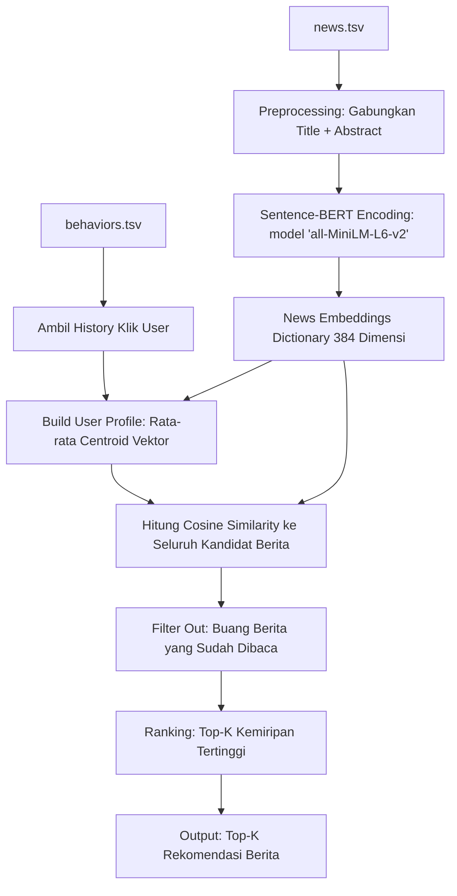

# Laporan Teknis: Arsitektur & Alur Kerja Sistem Rekomendasi Berita Berbasis Konten
### Menggunakan Sentence-BERT (SBERT) & Cosine Similarity pada Dataset MIND-small

Laporan ini menjelaskan secara rinci tentang berkas masukan (input files), alur pemrosesan data, serta bagaimana data tersebut diolah hingga menghasilkan rekomendasi berita personal berkualitas tinggi.

---

## 1. Berkas Masukan (Input Files)

Sistem rekomendasi ini menggunakan dataset **MIND-small (Microsoft News Dataset)** yang terdiri dari dua berkas utama:

### A. `news.tsv` (Metadata Berita)
Berkas ini menyimpan metadata lengkap untuk setiap artikel berita. Berkas ini tidak memiliki baris *header* secara bawaan, sehingga kolom didefinisikan secara manual sebagai berikut:

| Nama Kolom | Tipe Data | Deskripsi |
| :--- | :--- | :--- |
| **`NewsID`** | String (Kunci Utama) | ID unik artikel berita (contoh: `N55689`). |
| **`Category`** | String | Kategori utama berita (contoh: `news`, `sports`, `finance`). |
| **`SubCategory`** | String | Sub-kategori berita (contoh: `newsworld`, `football`). |
| **`Title`** | String | Judul berita. |
| **`Abstract`** | String | Ringkasan singkat isi berita. |
| **`URL`** | String | Tautan menuju artikel berita asli. |
| **`TitleEntities`** | JSON | Entitas nama (badan, tempat, orang) yang terdeteksi di judul berita. |
| **`AbstractEntities`** | JSON | Entitas nama yang terdeteksi di abstrak berita. |

> [!NOTE]
> Kolom yang paling krusial untuk pemrosesan teks adalah **`Title`** dan **`Abstract`**.

### B. `behaviors.tsv` (Log Aktivitas Pengguna)
Berkas ini mencatat histori interaksi pembaca berita dan log tayangan (impresi) berita. Kolom didefinisikan sebagai berikut:

| Nama Kolom | Tipe Data | Deskripsi |
| :--- | :--- | :--- |
| **`ImpressionID`** | String (Kunci Utama) | ID unik setiap sesi tayangan/impresi. |
| **`UserID`** | String | ID unik pengguna (contoh: `U13740`). |
| **`Time`** | Timestamp | Waktu terjadinya sesi tayangan berita. |
| **`History`** | String (Spaced-separated) | Riwayat ID berita yang pernah diklik/dibaca pengguna sebelum sesi ini (contoh: `N55689 N12345 N98765`). |
| **`Impressions`** | String (Spaced-separated) | Berita yang ditampilkan pada sesi tersebut beserta status klik (`1` untuk diklik, `0` jika diabaikan; contoh: `N123-1 N456-0 N789-0`). |

---

## 2. Alur Pemrosesan Data (Data Processing Pipeline)

Proses dari input hingga menghasilkan rekomendasi visual digambarkan melalui diagram alur berikut:

### Penjelasan Detail Langkah Demi Langkah:

#### Langkah 1: Pra-pemrosesan Teks (Preprocessing)
Sistem memuat data berita dan menggabungkan kolom judul (`Title`) dan ringkasan (`Abstract`) menjadi satu kolom teks utuh bernama `content`:
$$\text{content} = \text{Title} + \text{ " " } + \text{Abstract}$$
Teks kosong (*missing values*) diisi dengan string kosong `""`. Duplikat `NewsID` dibuang agar efisiensi pembuatan representasi vektor tetap terjaga.

#### Langkah 2: Ekstraksi Embedding Kalimat (Sentence-BERT Encoding)
Sistem menggunakan model deep learning **Sentence-BERT (`all-MiniLM-L6-v2`)** yang ditranslasikan ke GPU (bila tersedia) untuk mengubah teks `content` menjadi representasi vektor numerik padat (*dense vector*).
- Setiap berita diubah menjadi sebuah **vektor berdimensi 384**.
- Vektor-vektor ini merepresentasikan makna semantik dari berita tersebut.
- Hasil embedding disimpan dalam struktur kamus lookup (*dictionary*) berpasangan `{NewsID: Vektor_Embedding}` untuk akses cepat dengan kompleksitas $O(1)$.

#### Langkah 3: Representasi Minat Pengguna (User Profile Building)
Untuk mendeskripsikan ketertarikan seorang pengguna (misalnya pengguna `U13740`):
1. Sistem mencari semua `NewsID` dari kolom `History` di berkas `behaviors.tsv`.
2. Sistem mengambil vektor embedding untuk masing-masing berita yang ada dalam riwayat tersebut.
3. Sistem menghitung rata-rata (*mean centroid*) dari seluruh vektor tersebut:
   $$\vec{P}_{user} = \frac{1}{N} \sum_{i=1}^{N} \vec{E}_{news_i}$$
   Hasil akhir $\vec{P}_{user}$ adalah vektor **User Profile** berdimensi 384 yang mewakili titik pusat ketertarikan (preferensi) pengguna di ruang laten.

#### Langkah 4: Perhitungan Kemiripan (Similarity Calculation)
Untuk merekomendasikan berita baru:
1. Sistem mengidentifikasi daftar kandidat berita (seluruh berita di korpus yang **belum pernah dibaca** oleh pengguna).
2. Sistem menghitung tingkat kemiripan sudut (*Cosine Similarity*) antara vektor profil pengguna $\vec{P}_{user}$ dengan vektor embedding dari setiap berita kandidat $\vec{E}_{candidate}$:
   $$\text{Similarity}(\vec{P}, \vec{E}) = \frac{\vec{P} \cdot \vec{E}}{\|\vec{P}\| \|\vec{E}\|}$$
   Nilai Cosine Similarity berkisar antara -1 hingga 1, di mana nilai yang mendekati 1 menunjukkan tingkat kemiripan semantik yang sangat tinggi.

#### Langkah 5: Penyajian Hasil (Ranking & Output)
Berita diurutkan dari skor kemiripan tertinggi ke terendah. Sistem kemudian menampilkan **Top-K** berita teratas (disertai judul, kategori, dan skor kemiripan) ke hadapan pengguna melalui GUI Gradio atau output konsol.

---

## 3. Evaluasi Performa Sistem

Untuk menjamin kualitas rekomendasi secara ilmiah, sistem mengevaluasi prediksinya menggunakan data validasi (`dev_behaviors`):
1. **Precision@K**: Mengukur berapa persen berita yang direkomendasikan sistem benar-benar diklik oleh pengguna di sesi penayangan sesungguhnya.
2. **Recall@K**: Mengukur berapa persen berita yang diminati pengguna dalam sesi penayangan berhasil ditemukan oleh sistem rekomendasi.

---

## 4. Kesimpulan Ringkas

| Aspek | Detail |
| :--- | :--- |
| **Input Utama** | `news.tsv` (Konten artikel) & `behaviors.tsv` (Histori klik pembaca) |
| **Teknologi Utama** | Sentence-BERT (`all-MiniLM-L6-v2`) untuk representasi fitur teks semantik |
| **Pengukuran Relevansi** | Cosine Similarity antara centroid histori pembaca dan artikel baru |
| **Output Akhir** | Daftar terurut *Top-K* berita rekomendasi terdekat dengan minat pembaca |
